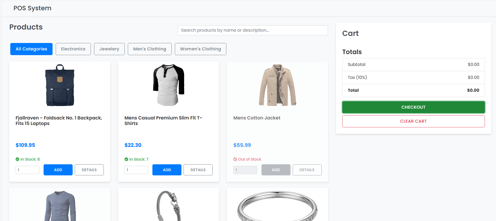

# Sale

A simple and responsive Point of Sale (POS) system built with HTML, CSS, and JavaScript. This single-page application allows users to browse products, add them to a cart, and simulate a checkout process. The project is designed to be easily deployable as a static website.

## Features

- **Product Catalog**: Fetches and displays a list of products from the [Fake Store API](https://fakestoreapi.com/).
- **Product Filtering**: Filter products by category and search by name or description.
- **Shopping Cart**: Add products to a shopping cart, update quantities, and remove items.
- **Responsive Design**: The layout is optimized for both desktop and mobile devices.
- **Local Storage**: The shopping cart and product data are persisted in the browser's local storage.
- **Checkout Simulation**: Generates a printable invoice upon checkout.

## Technologies Used

- **HTML**: The structure of the web page.
- **CSS**: Custom styling with Bootstrap for a modern and responsive design.
- **JavaScript**: The core logic of the application, with jQuery for DOM manipulation.
- **Bootstrap**: For UI components and responsive layout.
- **Fake Store API**: For product and category data.
- **GitHub Actions**: For continuous deployment to GitHub Pages.

## Getting Started

To get a local copy up and running, follow these simple steps.

### Prerequisites

You need a web browser to run this project.

### Installation

1. Clone the repo
   ```sh
   git clone https://github.com/your_username/Sale.git
   ```
2. Open `index.html` in your web browser.

## Project Structure

```
.
├── .env
├── .github
│   └── workflows
│       └── static.yml
├── api_categories.json
├── api_products.json
├── app.js
├── index.html
├── README.md
└── styles.css
```

## Screenshot



## Acknowledgements

- [Fake Store API](https://fakestoreapi.com/)
- [Bootstrap](https://getbootstrap.com/)
- [jQuery](https://jquery.com/)
- [Font Awesome](https://fontawesome.com/)

## License

Distributed under the MIT License. See `LICENSE` for more information.
